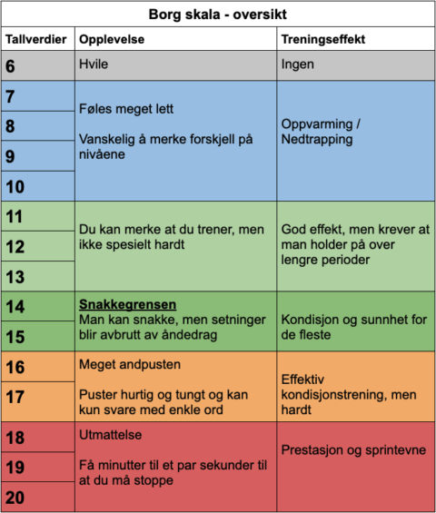
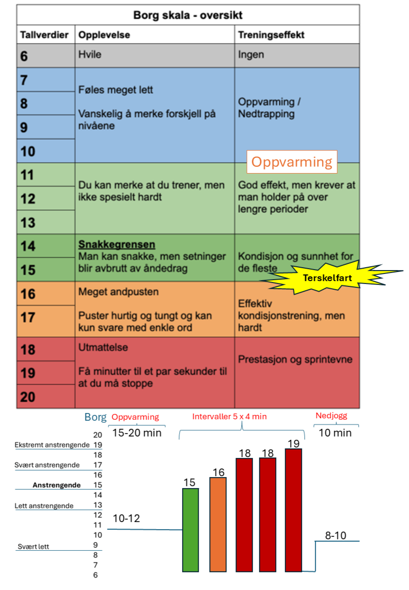

# Intensitet {#int}

## Intensitets verktøy - Borg skala

:::: {.columns}

::: {.column width="50%"}


:::

::: {.column width="50%"}


:::
::::


Under kan du relate anstrengelsesskalaen til Olympiatoppen sin intensitetsskala.


```{r int.tabsmall, message=FALSE, warning=FALSE, echo=FALSE}

int.small <- list(I_sone = c("I-3", "I-2", "I-1"),
           Intensitet=c('Hoy', 'Moderat', 'Lav'), 
           PulsavHFmax = c('90-100%', '80-90%', '60-80%'),
           Borg = c("18-20", "14-17", "<13")) |> 
  data.frame()


#names(int.small) <- c('I Sone', 'Intensitet', 'Puls (% av HF-maks)', "Borg skala")
 
kableExtra::kable(int.small,
                  caption = "3-delt intensitetsskala fra Olympiatoppen",
                  col.names = c('I Sone',
                                'Intensitet', 
                                'Puls (% av HF-maks)', 
                                'Borg skala')) |> 
  kableExtra::add_footnote(
    escape = FALSE,
    label = ".\\",
notation = "alphabet",
threeparttable = TRUE
)
          

```


```{r int.tabLARGE, message=FALSE, warning=FALSE, echo=FALSE}

int.large <- list(I_sone = c("I-5","I-4", "I-3", "I-2", "I-1"),
           Intensitet=c('Svaert Hoy', "Hoy", 'Moderat', "Moderat til lav", 'Lav'), 
           PulsavHFmax = c('>92%', '87-92%', '82-87%', "72-82%", "60-72"),
           Borg = c("18-20", "16-18", "14-16", "11-13", "<11")) |> 
  data.frame()


#names(int.small) <- c('I Sone', 'Intensitet', 'Puls (% av HF-maks)', "Borg skala")
 
kableExtra::kable(int.large,
                  caption = "5-delt intensitetsskala fra Olympiatoppen",
                  col.names = c('I Sone',
                                'Intensitet', 
                                'Puls (% av HF-maks)', 
                                'Borg skala')) |> 
  kableExtra::add_footnote(
    escape = FALSE,
    label = ".\\",
notation = "alphabet",
threeparttable = TRUE
)
          

```


