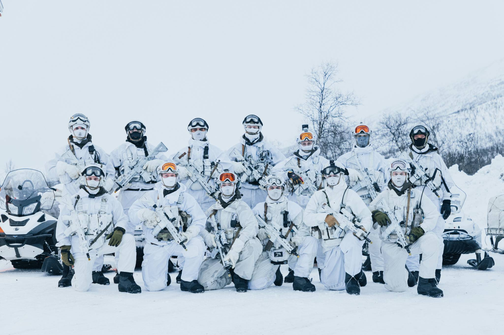

# Introduksjon

*"Når mye er innarbeidet, frigjøres mental kapasitet til å håndtere det uforutsette"*

Dette sitat er fra en av feltoperatørene fra fjernoppklaringseskadronen som deltok i FAM100. FAM100 er den lengste feltøvelsen d.d. gjennomført som et realistisk sceneario. Feltoperatøren var i beredskap i arktisk terreng i 100 dager og løste realistiske oppdrag uten annen støtte enn sitt eget lag.

For å klare å være i beredskap over tid under slike ekstreme forhold med uforutsette scenarioer er det en rekke forutsetninger som må være på plass for å imøtekomme de krav som møter soldaten. Bortsett fra blant annet riktig utstyr, er riktig trening herunder god fysisk form og mental kapasitet en forutsetning. I lys av dette er soldatens utholdenhetskapasitet en viktig faktor for å være operativ over tid, og dette er uavhengig av stilling. Mer om denne sammenhengen senere i denne modulen.

Denne siden vil gi en kort innføring i teori omkring utholdenhetstrening og hvordan din fysiske form står i sammenheng med din operative evne. I praksisøktene gjennomføres intensitetsstyring gjennom forskjellige utholdenhetsmetoder, arbeidsspesifikke utholdenhetsøkter og kadettstyrteøkter.

Etter denne korte modulen skal du ha kunnskap og ferdigheter om:

■ Kjenne til sammenhengen mellom utholdenhetskapasitet og fysisk og kognitive prestasjonsevne\
■ Kjenne til metodene for utholdenhetstrening\
■ Kjenne intensitetssonene som er typisk å referere til og styre etter i din utholdenhetstrening\
■ Kunne legge opp utholdenhetstrening tilpasset utøveres/soldatens forutsetninger og stilling/avdelingen de trener 
for å bli bedre i 

[1. For mer info om FAM100 feltstudien - Forsvaret](https://www.forsvaret.no/aktuelt-og-presse/aktuelt/fam100-lederskap)

[2. FAM100 feltstudien - FFI](https://www.ffi.no/aktuelt/podkaster/hva-gjor-100-dager-i-vinterkrig-med-menneskekroppen)
